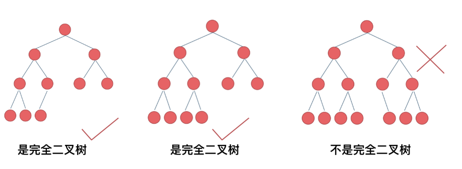
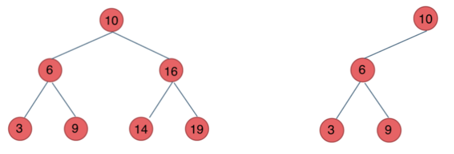
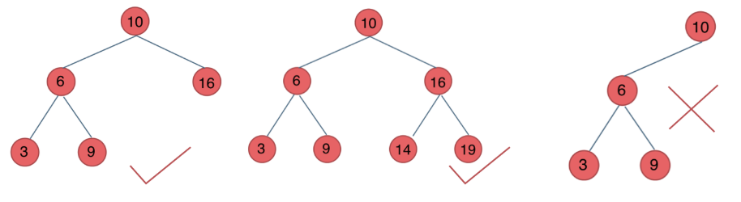
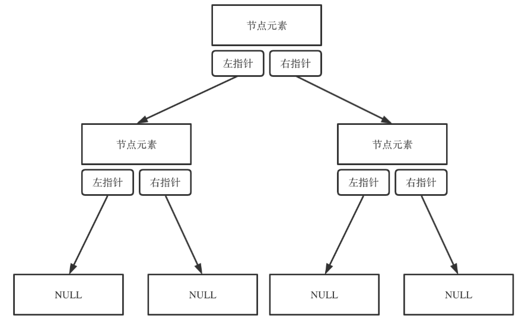
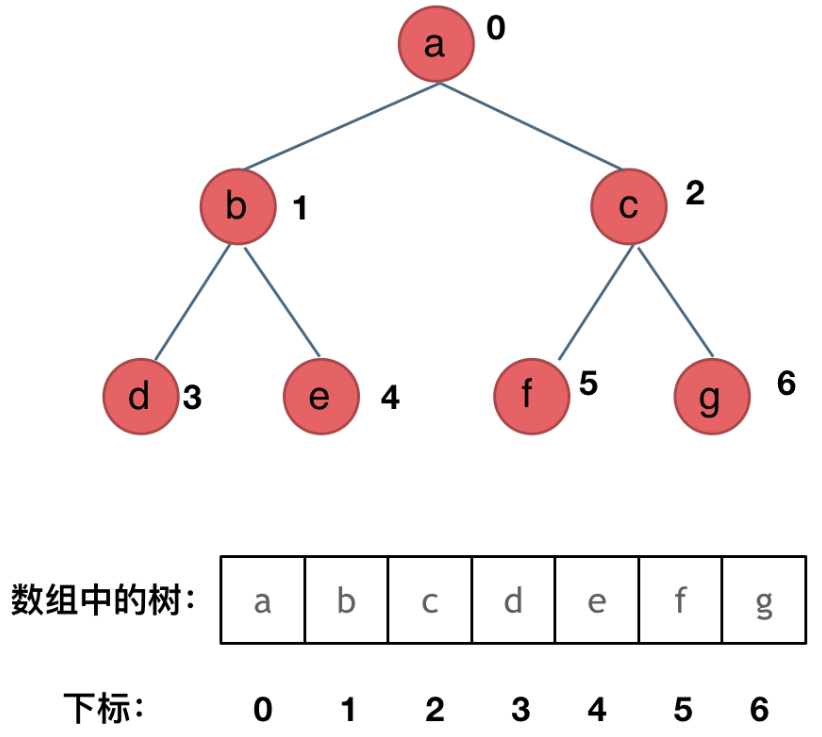

# 二叉树理论基础
在讲二叉树之前，先要理解什么是树。

树是一种**非线性**的数据结构，它由节点（Node）和连接节点的边（Edge）组成。你可以想象成一棵树倒过来：
- 最上面有一个“根”（Root）
- 根下面分出很多“分支”
- 每个分支又可以有更细的分支
- 最后是“叶子”（Leaf），没有分支了
## 什么是二叉树
二叉树（Binary Tree）是树的一种特殊形式：**每个节点最多只能有两个子节点**，分别称为左子节点和右子节点。
## 二叉树的种类
### 满二叉树
定义：**每个节点要么是叶子，要么有左右两个子节点**。也就是说，没有节点只有一个子节点。深度为k，有2^k-1个节点的二叉树。
```text
        1
       / \
      2   3
     / \ / \
    4  5 6  7
```
### 完全二叉树
定义：除了最后一层，其他层的节点都是满的，并且最后一层的节点都尽可能靠左排列。若最底层为第 h 层（h从1开始），则该层包含 1~ 2^(h-1) 个节点。

### 平衡二叉树
定义：任意节点的左右子树高度差不超过 1。这是一种“大致平衡”的树，用来保证操作效率。

例如 AVL 树、红黑树都是平衡二叉树的变种。
### 二叉搜索树
定义：对于任意节点，**左子树所有节点的值 < 根节点的值 < 右子树所有节点的值**，并且左右子树也是二叉搜索树。

这种树可以快速查找数据（类似二分查找）。

前面介绍的树，都没有数值的，而二叉搜索树是有数值的了，**二叉搜索树是一个有序树**。


* 若它的左子树不空，则左子树上所有结点的值均小于它的根结点的值；
* 若它的右子树不空，则右子树上所有结点的值均大于它的根结点的值；
* 它的左、右子树也分别为二叉排序树

下面这两棵树都是搜索树


### 平衡二叉搜索树

平衡二叉搜索树：又被称为AVL（Adelson-Velsky and Landis）树，且具有以下性质：它是一棵空树或它的左右两个子树的高度差的绝对值不超过1，并且左右两个子树都是一棵平衡二叉树。

如图：



最后一棵 不是平衡二叉树，因为它的左右两个子树的高度差的绝对值超过了1。
## 二叉树的存储方式
**二叉树可以链式存储，也可以顺序存储**

那么链式存储方式就用指针， 顺序存储的方式就是用数组。

顾名思义就是顺序存储的元素在内存是连续分布的，而链式存储则是通过指针把分布在各个地址的节点串联一起。

链式存储如图：


用数组来顺序存储二叉树，如图：

用数组来存储二叉树如何遍历的呢？

如果父节点的数组下标是 i，那么它的左孩子就是 i * 2 + 1，右孩子就是 i * 2 + 2。

但是用链式表示的二叉树，更有利于理解，所以一般都是用链式存储二叉树。
## 二叉树的遍历
遍历就是按某种顺序访问树中的每个节点。主要有两种大类：深度优先遍历（DFS）和广度优先遍历（BFS）。
1. 深度优先遍历：先往深走，遇到叶子节点再往回走。
2. 广度优先遍历：一层一层的去遍历。

从深度优先遍历和广度优先遍历进一步拓展，才有如下遍历方式：
* 深度优先遍历
  * 前序遍历（递归法，迭代法）
  * 中序遍历（递归法，迭代法）
  * 后序遍历（递归法，迭代法）
* 广度优先遍历
  * 层次遍历（迭代法）

前中后序遍历的逻辑其实都是可以借助栈使用递归的方式来实现的。

而广度优先遍历的实现一般使用队列来实现，这也是队列先进先出的特点所决定的，因为需要先进先出的结构，才能一层一层的来遍历二叉树。
## 二叉树的定义
```python
class TreeNode:
    def __init__(self, val, left = None, right = None):
        self.val = val
        self.left = left
        self.right = right
```