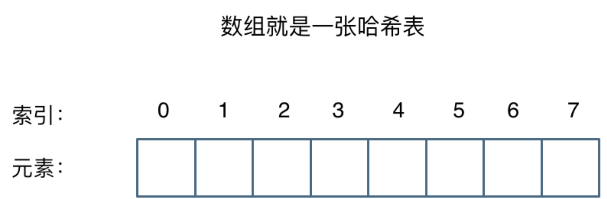
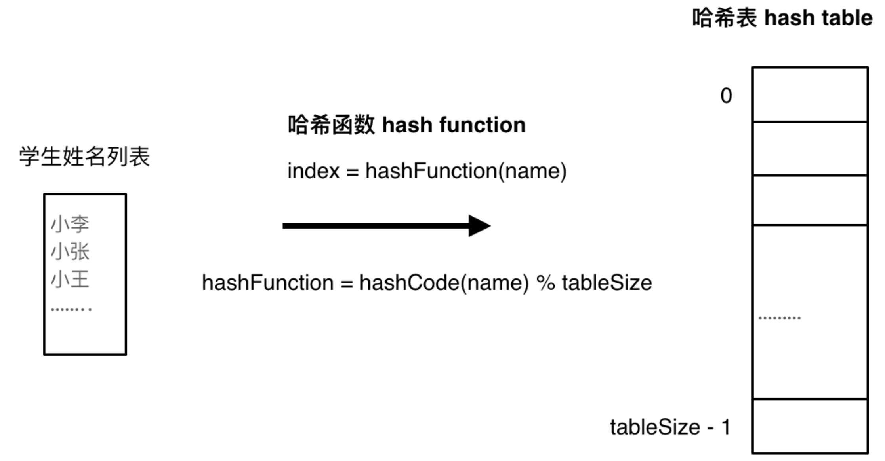
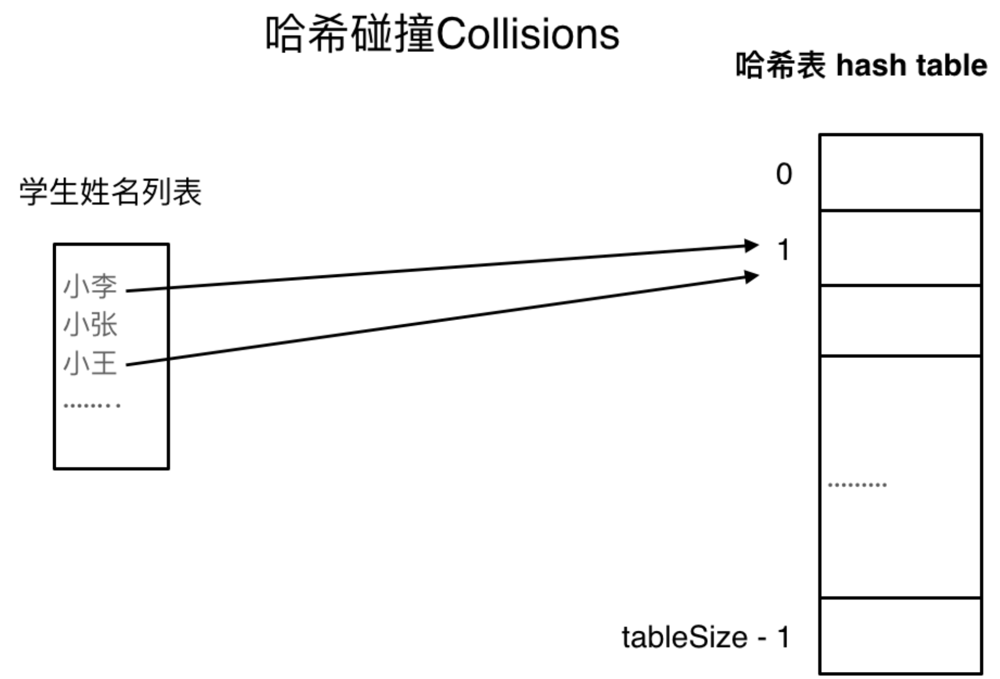
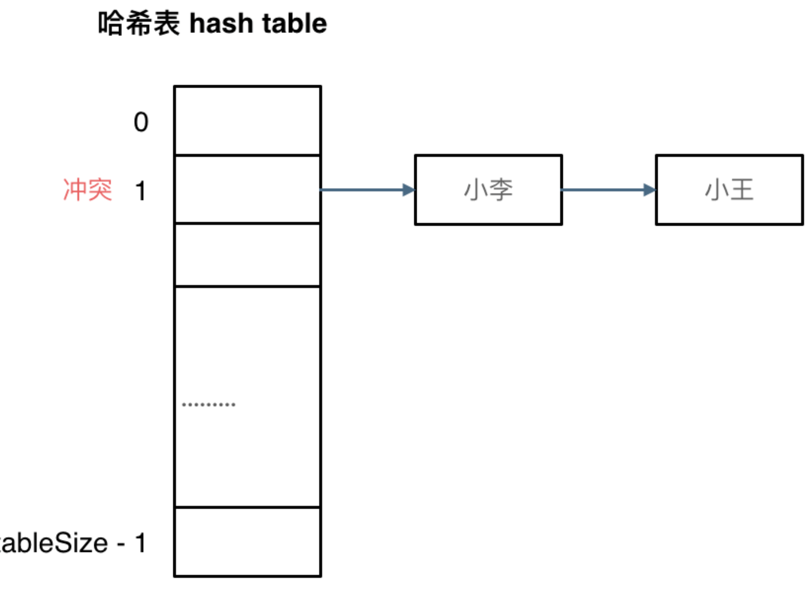

# 哈希表理论基础
哈希表是**根据关键码的值而直接进行访问的数据结构。**
> 牺牲了空间换取了时间，因为要使用额外的数组，set或者是map来存放数据，才能实现快速的查找。
直白来讲其实数组就是一张哈希表。

哈希表中关键码就是数组的索引下标，然后通过下标直接访问数组中的元素

哈希表由一个数组（可以看作是一排连续的抽屉）和一个哈希函数组成。当你需要存储一个键值对（比如 "apple" 对应 5）时，哈希表会：
1. 把键（"apple"）传给哈希函数。
2. 哈希函数计算出一个整数（称为哈希值）。
3. 将这个整数映射到数组的某个位置（通常是用哈希值对数组长度取模）。
4. 把值 5 存放到那个位置。

以后你想查找 "apple" 的值时，只要再次用同一个哈希函数计算位置，就可以直接取出 5。整个过程就像“按拼音找页码”一样快。

**一般哈希表都是用来快速判断一个元素是否出现集合里。**
## 哈希函数
哈希函数是哈希表的核心，它必须满足两个基本要求：
- 确定性：同一个键，每次计算出的哈希值必须相同。
- 高效性：计算过程要非常快。

哈希函数如下图所示，通过hashCode把名字转化为数值，一般hashcode是通过特定编码方式，可以将其他数据格式转化为不同的数值，这样就把学生名字映射为哈希表上的索引数字了。

如果hashCode得到的数值大于 哈希表的大小了，也就是大于tableSize了，怎么办呢？

此时为了保证映射出来的索引数值都落在哈希表上，我们会在再次对数值做一个取模的操作，这样我们就保证了学生姓名一定可以映射到哈希表上了。

此时问题又来了，哈希表我们刚刚说过，就是一个数组。

如果学生的数量大于哈希表的大小怎么办，此时就算哈希函数计算的再均匀，也避免不了会有几位学生的名字同时映射到哈希表 同一个索引下标的位置。

接下来**哈希碰撞**登场
## 哈希碰撞
如图所示，小李和小王都映射到了索引下标 1 的位置，这一现象叫做**哈希碰撞**。

一般哈希碰撞有两种解决方法， 拉链法和线性探测法。
### 拉链法

这种方法最简单：数组的每个位置不再直接存放值，而是存放一个链表（或其他数据结构）的头指针。当多个键映射到同一个位置时，就把它们依次挂在链表中。
- 插入：计算位置，把键值对插入到对应链表的末尾（或开头）。
- 查找：计算位置，然后在链表中顺序查找键。
- 优点：实现简单，删除方便，内存利用率高（链表只在需要时才分配）。
- 缺点：如果链表太长，查找会退化成 O(n)，所以需要控制链表的长度。

刚刚小李和小王在索引1的位置发生了冲突，发生冲突的元素都被存储在链表中。 这样我们就可以通过索引找到小李和小王了

（数据规模是dataSize， 哈希表的大小为tableSize）

其实拉链法就是要选择适当的哈希表的大小，这样既不会因为数组空值而浪费大量内存，也不会因为链表太长而在查找上浪费太多时间。

### 开放地址法（Open Addressing）
这种方法不额外使用链表，而是当冲突发生时，在数组内部寻找另一个空闲位置存放。寻找下一个位置的过程称为探测。常见的探测方式有：

1. **线性探测（Linear Probing）**：如果位置 i 被占，就依次尝试 i+1, i+2, ... 直到找到空位。
缺点：容易产生“聚集”现象，即连续的位置被占用，导致后续插入需要探测很多次。

2. **二次探测（Quadratic Probing）**：探测位置为 i+1², i+2², i+3², ...。这样可以缓解聚集，但可能探测不到整个数组。

3. **双重哈希（Double Hashing）**：使用第二个哈希函数计算步长，探测位置为 i + k * hash2(key)。这种方法能较好地分散数据。

开放地址法不需要额外的链表，但删除元素时需要特殊处理（比如打标记，不能直接清空，否则会影响后续查找）。它适用于数据量较小且能预知容量的场景。
